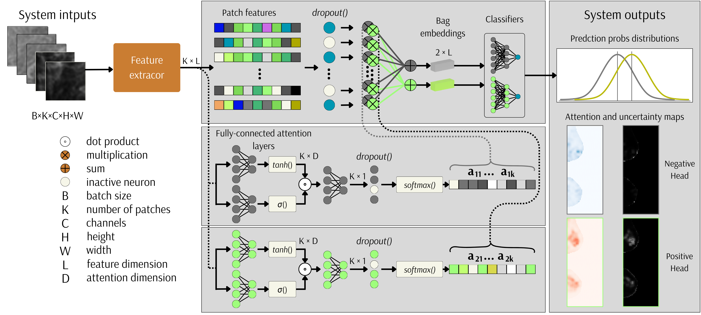
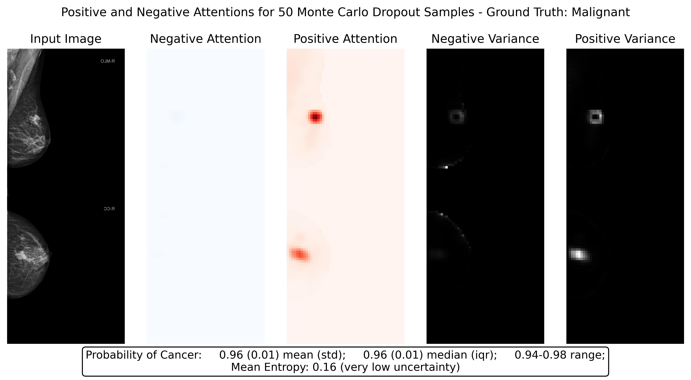

# Breast Mammography Classification with GA-MIL and MCDO

This project implements **Gated Attention Multiple Instance Learning (GA-MIL)** combined with **Monte Carlo Dropout (MCDO)** for breast mammography classification.

## Overview

- **Feature extractor**: Extracts features from instances / image patches. Done only once per bag.
- **GA-MIL**: Predicts classification outcomes and generates attention maps highlighting important image features [1]. Extended to Multi-headed (MH) version, one head for positive class and one for negative.
- **MCDO**: Enables the computation of uncertainty in both prediction probabilities and attention weights, providing uncertainty-aware attention maps [2]. Adapted within MH-GA, computed N times for MCDO inference.

During the inference, computation overhead is minimal since feature extraction using a Convolutional Neural Network (CNN) is performed only once. The multiple forward passes with dropout during inference are limited to the attention module and the final classification module.

**NOTE**: In MIL, each input image is divided into patches, which are processed independently by e.g. ResNet-18 model for feature extraction [3]. Since, a batch size of 1 is used, a reshape from 5D to 4D tensor is required transforming dims in the following `(1, N, C, H, W)` to `(N, C, H, W)`. Since the number of patches `(N)` varies between images, `BatchNorm2d()` would compute inconsistent statistics across different samples, leading to unstable training. Also `BatchNorm2d()` assumes the patches are independent samples which is not true in this case. Thus, all BatchNorms in the feature extractor were disabled.

## System Architecture

The diagram above illustrates the workflow of the GA-MIL and MCDO integration for breast mammography classification. It highlights the feature extraction, attention mechanism, uncertainty estimation, and final classification steps.

## Visualization

Below is an example of the MCDO inference showcasing the attention maps and uncertainty estimation:

The image demonstrates how the MCDO GA-MIL model highlights critical regions in the mammogram (with mean negative and positive attentions) while additionally providing uncertainty-aware attention maps (attention weights varianve).

## References

1. M. Ilse, J. Tomczak, and M. Welling, ‘Attention-based Deep Multiple Instance Learning’, in Proceedings of the 35th International Conference on Machine Learning, PMLR, Jul. 2018, pp. 2127–2136. [LINK](https://proceedings.mlr.press/v80/ilse18a.html)

2. Y. Gal and Z. Ghahramani, ‘Dropout as a Bayesian Approximation: Representing Model Uncertainty in Deep Learning’, in Proceedings of The 33rd International Conference on Machine Learning, PMLR, Jun. 2016, pp. 1050–1059. [LINK](https://proceedings.mlr.press/v48/gal16.html)
3. K. He, X. Zhang, S. Ren, and J. Sun, ‘Deep Residual Learning for Image Recognition’, in 2016 IEEE Conference on Computer Vision and Pattern Recognition (CVPR), Jun. 2016, pp. 770–778. doi: 10.1109/CVPR.2016.90. [LINK](https://ieeexplore.ieee.org/document/7780459)
